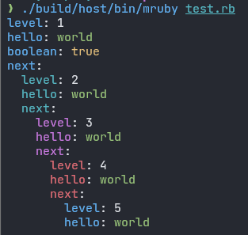

# mruby-rapidyaml

[rapidyaml](https://github.com/biojppm/rapidyaml/) binding for mruby

## Build Requirements

To build mruby-rapidyaml, you will need the following:

* C++11 compatible compiler
  - clang++ 3.9 and later
  - g++ 4.8 and later

Note: rapidyaml is written in C++11, hence a C++11 compatible compiler is required.

## Installation

Add the following line to your `build_config.rb`:

```ruby
MRuby::Build.new do |conf|
-- snip --

  conf.gem github: 'buty4649/mruby-rapidyaml'
end
```

## Implemented Methods

| Method             | mruby-rapidyaml | Description    |
|--------------------|-----------------|----------------|
| YAML.#dump         | ✓               |                |
| YAML.#load         | ✓               |                |
| YAML.#load_file    | ✓               | needs mruby-io |
| YAML.color_null    | ✓               | see. colorize  |
| YAML.color_string  | ✓               | see. colorize  |
| YAML.color_map_key | ✓               | see. colorize  |
||||
| Object#to_yaml     | ✓               |                |

## Colorize



The `mruby-rapidyaml` library now supports colorized YAML output, making it easier to read and debug complex YAML documents. By setting the `colorize` option to `true` in the `YAML#dump` method, you can achieve syntax-highlighted YAML output.

### Default Colors

- `null`: gray
- `boolean`: yellow
- `string`: blue
- `map keys`: Colors vary by hierarchy level
  - Level 1: blue
  - Level 2: cyan
  - Level 3: magenta
  - Level 4: red
  - Levels 5 and beyond: cycle through blue, cyan, magenta, and red again

### Customizing Colors

You can customize these colors using the following methods:

- `YAML.color_null`: Sets the color for `null` values
- `YAML.color_boolean`: Sets the color for `boolean` values
- `YAML.color_string`: Sets the color for string values
- `YAML.set_color_map_key(level, color)`: Sets the color for map keys at a specific hierarchy level

Refer to [mruby-terminal-color](https://github.com/buty4649/mruby-terminal-color) for details on specifying colors.

## YAML Parsing Differences

The original rapidyaml library allows colons (:) to be included in anchors, following the YAML specification. However, both the CRuby yaml library and mruby-yaml do not support colons in anchors.For example, the following YAML will not produce an error in the CRuby yaml library or mruby-yaml. However, it will result in a parsing error in the original rapidyaml:

```yaml
foo: &foo bar
*foo: bar
```
 To align with the behavior of these libraries, mruby-rapidyaml applies a [patch](https://github.com/buty4649/mruby-rapidyaml/commit/5399b585219fa40183deb5d98db4ef30f35652a4#diff-417aa3d4f5a1a55c47d6c1a9f3fbfd9e043fac55cd2196c7417adc7a5dd749d8) that removes this capability.

## Limitations

mruby-rapidyaml is subject to the [Known limitations](https://github.com/biojppm/rapidyaml?tab=readme-ov-file#known-limitations) of the original rapidyaml library.

- Tab characters after `:` and `-` are not accepted unless mruby-rapidyaml is compiled with the `RYML_WITH_TAB_TOKENS` macro. This limitation exists because checking for tab characters introduces branching into the parser's hot code, which can increase parsing time by up to 10% in some cases.
- The `%YAML` directive is ignored.

## License

mruby-rapidyaml is licensed under the MIT License.
mruby-rapidyaml includes code from rapidyaml([ryml_all.hpp](src/ryml_all.hpp)), which is also licensed under the MIT License.
For more details, see the [LICENSE](./LICENSE) file.
