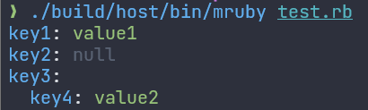

# mruby-rapidyaml

[rapidyaml](https://github.com/biojppm/rapidyaml/) binding for mruby

## Build Requirements

To build mruby-rapidyaml, you will need the following:

* C++11 compatible compiler
  - clang++ 3.9 and later
  - g++ 4.8 and later

Note: rapidyaml is written in C++11, hence a C++11 compatible compiler is required.

## Installation

Add the following line to your `build_config.rb`:

```ruby
MRuby::Build.new do |conf|
-- snip --

  conf.gem github: 'buty4649/mruby-rapidyaml'
end
```

## Implemented Methods

| Method                | mruby-rapidyaml | Description    |
|-----------------------|-----------------|----------------|
| YAML.#dump            | ✓               |                |
| YAML.#load            | ✓               |                |
| YAML.#load_file       | ✓               | needs mruby-io |
| YAML.color_null       | ✓               | see. colorize  |
| YAML.color_string     | ✓               | see. colorize  |
| YAML.color_object_key | ✓               | see. colorize  |
||||
| Object#to_yaml        | ✓               |                |

## colorize

The `colorize` option can be specified when using `YAML.#dump` to add colors to the output. When `colorize: true` is set, the following elements will be colored:

- `null`: gray
- `string`: green
- `Object keys`: blue

Example usage:

```ruby
data = {
  "key1" => "value1",
  "key2" => nil,
  "key3" => "value3"
}

puts YAML.dump(data, colorize: true)
```



You can customize the colors using the following methods:

- `YAML.color_null`: Changes the color of null values.
- `YAML.color_string`: Changes the color of string values.
- `YAML.color_object_key`: Changes the color of Object keys.

To see the available colors, refer to the [mruby-terminal-color basic example](https://github.com/buty4649/mruby-terminal-color/?tab=readme-ov-file#basic-example).

## License

mruby-rapidyaml is licensed under the MIT License.
mruby-rapidyaml includes code from rapidyaml([ryml_all.hpp](src/ryml_all.hpp)), which is also licensed under the MIT License.
For more details, see the [LICENSE](./LICENSE) file.
